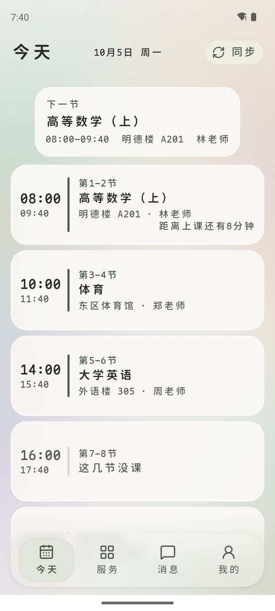
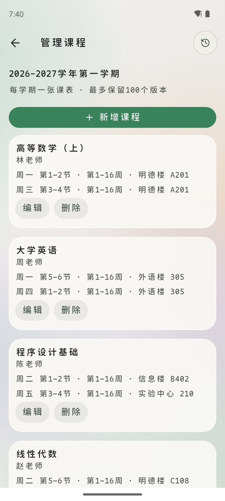
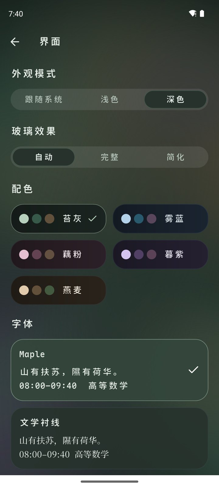
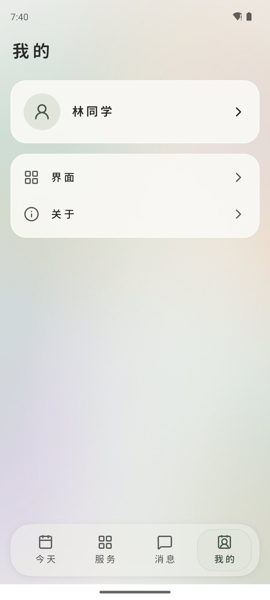
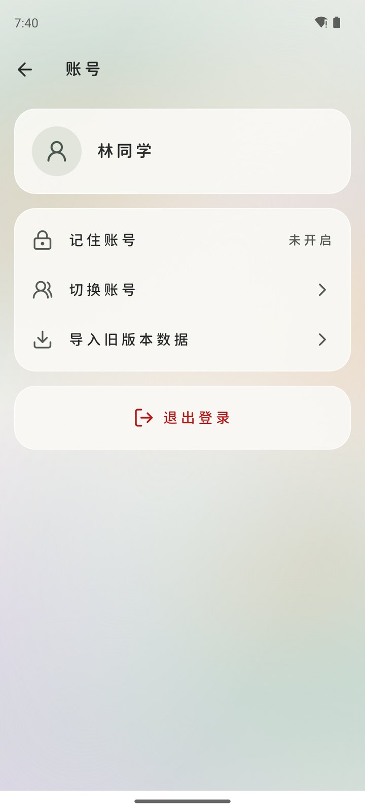
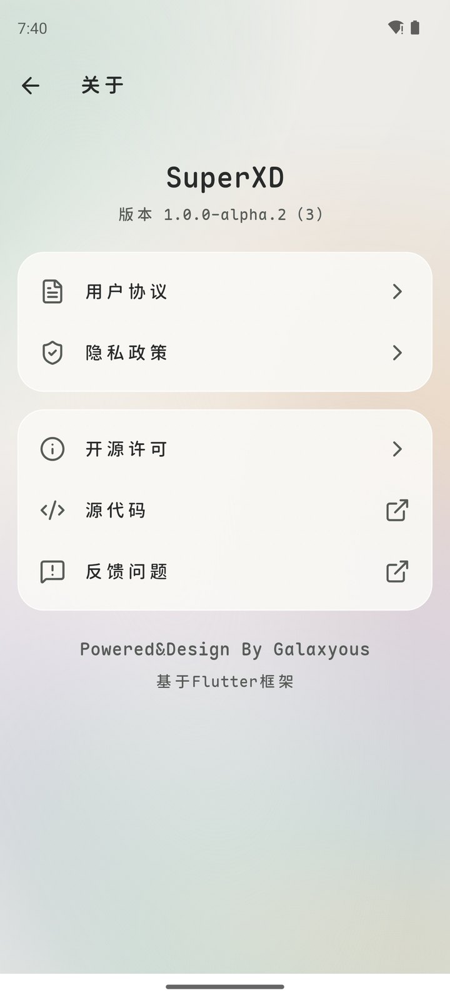

<div align="center">

# SuperXD

在手机上看课表、查成绩，和同学分享课表找共同空闲。

开源、非官方的校园教务客户端，目前对接山东现代学院的 Kingo 教务系统；另附免登录的百宝箱。

[](https://github.com/huverse/SuperXD/releases)
[](https://github.com/huverse/SuperXD/releases)
[](https://flutter.dev)
[](https://github.com/huverse/SuperXD/actions/workflows/ci.yml)
[](LICENSE)

**[下载 APK](https://github.com/huverse/SuperXD/releases) · [反馈问题](https://github.com/huverse/SuperXD/issues) · [更新记录](CHANGELOG.md)**

[界面预览](#界面预览) · [功能](#功能) · [开始使用](#开始使用) · [隐私与安全](#隐私与安全) · [从源码构建](#从源码构建) · [许可](#许可)

</div>

> [!WARNING]
> 当前是 **Alpha 测试版**：功能和数据可能出错，课表与成绩请以学校系统为准。本应用不是学校官方应用，与学校没有隶属或合作关系。

## 界面预览

以下截图来自 Android 模拟器，课程、教师、教室和姓名均为虚构的演示数据（[tool/readme_demo.dart](tool/readme_demo.dart)）。

<table>
  <tr>
    <th>今天的课，按时间排好</th>
    <th>课程自己管，改错可恢复</th>
    <th>深色与自定义外观</th>
  </tr>
  <tr>
    <td></td>
    <td></td>
    <td></td>
  </tr>
  <tr>
    <th>我的</th>
    <th>账号</th>
    <th>关于</th>
  </tr>
  <tr>
    <td></td>
    <td></td>
    <td></td>
  </tr>
</table>

## 功能

| 功能 | 内容 |
| --- | --- |
| 今天 | 当天课程按节次排列，显示上课倒计时；上下滑动切换日期 |
| 课表 | 天、学期、学年三种视图；手动增删改课程、历史版本可恢复；导出到系统日历；课前提醒 |
| 成绩 | 按学期或学年查看成绩、学分与绩点，支持筛选、排序和搜索 |
| 桌面小组件 | 下一节课、接下来两节、今日课程三种尺寸，不打开应用也能看 |
| 私信 | 扫码互加好友，分享课表、界面配置和短视频卡片；查看好友课表并列出共同空闲时段。内容端到端加密，不做文字聊天 |
| 百宝箱 | 免教务登录；短视频与图集解析、预览和下载（依赖第三方解析服务） |
| 外观 | 五套配色、浅色与深色、三种字体、字号、液态玻璃效果和自定义背景 |

同步只在你点击时进行，平时只读本机数据。教务限流时自动排队，失败时保留本机数据、不会误清空。

## 开始使用

1. 从 [Releases](https://github.com/huverse/SuperXD/releases) 下载 APK。大多数手机选 `arm64-v8a`，较老的 32 位手机选 `armeabi-v7a`；下载后可用同页的 `SHA256SUMS` 校验。
2. 安装后用本人的教务账号登录，在“今天”页点“同步”拉取课表与成绩，按提示设置开学日。
3. 想和同学互看课表：在“消息 › 私信”开启私信，扫码加好友后分享。

<details>
<summary><strong>常见问题</strong></summary>

- **能用在其他学校吗？** 暂时不能。教务地址和作息解析目前只适配山东现代学院，换校需要改源码（见 [lib/edu](lib/edu)）。
- **课表日期不对：** 检查开学日和作息；作息里没有的节次不会猜时间。
- **提醒不准时：** 在课表 ⋯ 菜单的“课前提醒”里按提示开启通知和“闹钟和提醒”权限。
- **私信收不到：** 目前只在应用打开时收取，没有后台推送。
- **从 1.0.0-alpha.1 升级：** alpha.2 换了签名，需要先卸载旧版再安装，旧版本机数据不保留。

</details>

## 隐私与安全

- 应用不含广告、行为统计或崩溃上报 SDK。教务账号、课表和成绩只在本机与学校教务系统之间传输，开发者收不到。
- 学校教务系统目前只提供 HTTP 明文连接，请只在可信网络登录。勾选“记住账号”后，凭据加密保存在系统安全存储，可随时关闭。
- 私信经开发者自建的中转服务转交，内容在本机加密（X25519 + AES-256-GCM），服务器只看得到密文、设备号、好友关系和时间。测试期中转为 HTTP 明文，这些元数据对网络中间方可见。服务端源码在 [server](server)。
- 完整说明见应用内“我的 › 关于 › 隐私政策”（源文件 [lib/page/legal_page.dart](lib/page/legal_page.dart)）。

安全问题请不要公开提交 Issue，使用 GitHub 的 [私密漏洞报告](https://github.com/huverse/SuperXD/security/advisories/new)。

## 从源码构建

需要 Flutter 3.47.2（Dart 3.13.2）与 Android SDK，依赖锁定在 `pubspec.lock`。

```sh
git clone https://github.com/huverse/SuperXD.git
cd SuperXD
flutter pub get --enforce-lockfile
flutter analyze
flutter test
flutter run
```

默认构建开发包（包名 `com.superxd.superxd`）。私信需要在构建时指定中转服务地址，不指定时私信显示“未配置”，其余功能不受影响：

```sh
flutter run --dart-define=SUPERXD_RELAY=http://你的中转地址:端口
```

中转服务（NestJS + MySQL + Redis）的开发、测试与 Docker 部署见 [server/README.md](server/README.md)。发布签名、版本与发行流程见 [CONTRIBUTING.md](CONTRIBUTING.md)。

<details>
<summary><strong>仓库目录</strong></summary>

```text
lib/
  domain/       领域类型、端口与规则（纯 Dart）
  edu/          教务协议与页面解析
  local/        本机存储（SQLite、显示设置）
  gateway/      账号生命周期与教务网关
  application/  同步、课前提醒、小组件编排
  device/       系统通知、桌面小组件适配
  social/       私信身份、好友与中转客户端
  toolbox/      百宝箱
  page/         页面
  theme/        主题、玻璃与动效组件
server/         私信中转服务
android/        Android 宿主（小组件、导出通道）
test/           自动化测试（只用合成数据）
tool/           手动验证与截图入口，不进 CI
```

依赖只许自上而下，由 `test/project_structure_test.dart` 检查。各目录的 `CLAUDE.md` 是项目索引，记录文件职责与跨模块约定。

</details>

## 参与开发

欢迎提交 [Issue](https://github.com/huverse/SuperXD/issues) 和 Pull Request。改动前请读 [CONTRIBUTING.md](CONTRIBUTING.md)：功能在短分支开发、通过 CI 后合并；测试与截图只用合成数据，不要提交真实账号、课表、成绩、Cookie 或日志。

反馈问题时请写明应用版本、手机型号与系统版本、操作步骤和看到的提示，截图记得遮住学号姓名。也可以联系开发者：QQ 209320162，邮箱 vbhcchhvvvhh@gmail.com（涉及个人信息的请求请走这里，不要发在公开 Issue）。

## 许可

SuperXD 以 [GNU GPL v3.0](LICENSE) 开源，版权所有 (C) 2026 Galaxyous。修改和再分发时请保留版权与许可说明，并按 GPL 提供对应源码。

以下部分不随本项目以 GPL 授权：

- `lib/theme/curve_geometry.dart` 中的曲线加载动画改编自 [Paidax01/math-curve-loaders](https://github.com/Paidax01/math-curve-loaders)，上游未附开源许可，本项目已获作者授权使用。再分发本项目或其修改版时，请自行取得授权，或移除、替换这部分代码。
- 内置字体 Maple Mono NF CN 与 Noto Serif SC 按 SIL Open Font License 1.1 分发。
- 测试期临时启动图标（android/app/src/main/res 下的 ic_launcher 与 ic_launcher_background）使用动画《Charlotte》角色画面，版权归原权利人所有（©VisualArt's/Key/Charlotte Project），仅供测试期间临时使用，正式版前替换为原创图标。
- 其他第三方组件按各自许可使用，清单见 [assets/third_party_notices.txt](assets/third_party_notices.txt)，或应用内“我的 › 关于 › 开源许可”。

本项目与学校、Kingo 教务系统及短视频平台均无关联。短视频解析依赖第三方服务，请只处理本人或已获授权的作品。
